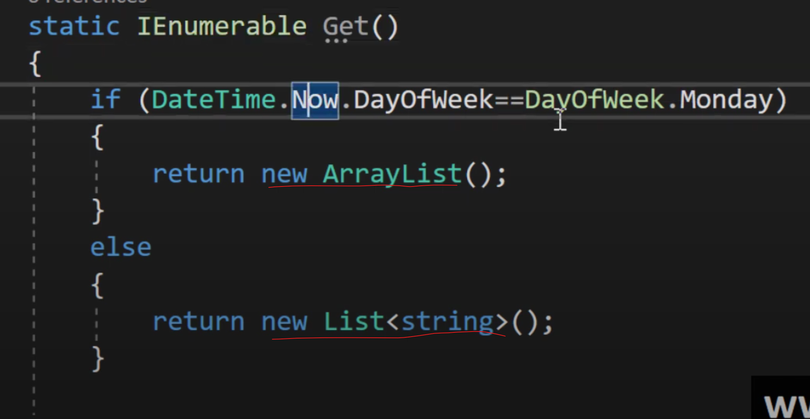
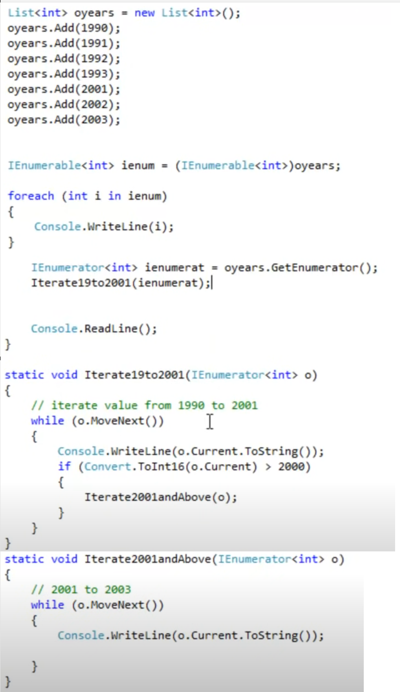
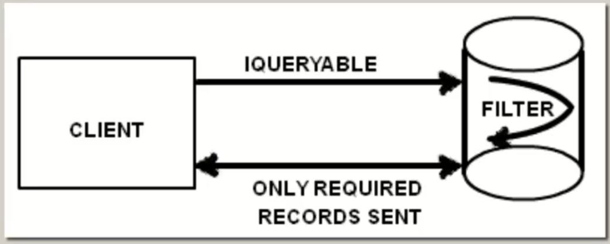
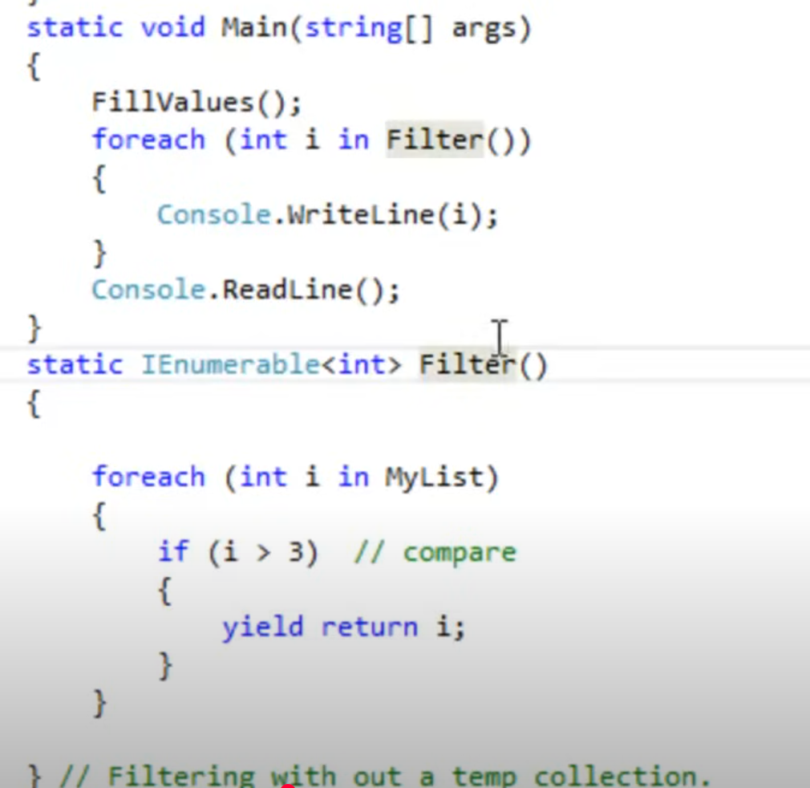
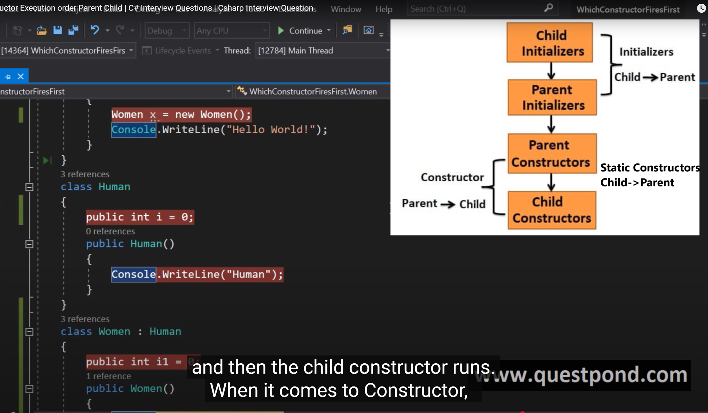
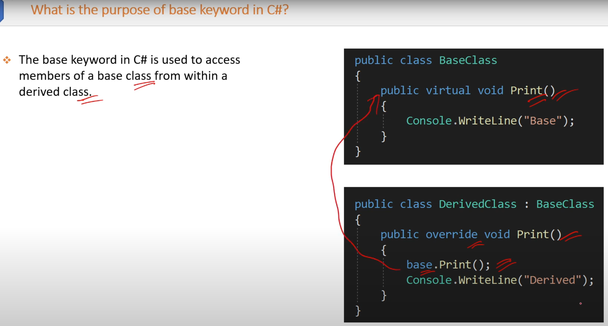

## ***1. What is the use of private constructor***

##### 1. A class with a private constructor can not be inherited

##### 2. We can not create a object of the class which has private constructor

##### 3. Many times we do not want to create instances of certain classes like utility, common routine classes

In C#, a private constructor is used to restrict the instantiation of a class from outside the class itself. Here are some common uses of private constructors:

### **1. Singleton Pattern**

A private constructor is often used in the Singleton design pattern to ensure that only one instance of the class can be created. This is useful when you need a single, shared instance of a class throughout the application.

**Example**:

```csharp
public class Singleton
{
    private static Singleton _instance;
    
    // Private constructor
    private Singleton() { }
    
    public static Singleton Instance
    {
        get
        {
            if (_instance == null)
            {
                _instance = new Singleton();
            }
            return _instance;
        }
    }
}
```

### **2. Static Classes**

A private constructor can be used to prevent the instantiation of a static class. Static classes cannot be instantiated, and by declaring a private constructor, you ensure that no instances of the class are created accidentally.

**Example**:

```csharp
public static class Utility
{
    // Private constructor
    private Utility() { }

    public static void DoSomething()
    {
        // Implementation
    }
}
```

### **3. Factory Methods**

Private constructors can be used in combination with factory methods to control the creation of instances. Factory methods allow you to create instances of a class in a controlled manner, often with additional logic.

**Example**:

```csharp
public class Product
{
    public string Name { get; private set; }

    // Private constructor
    private Product(string name)
    {
        Name = name;
    }

    // Factory method
    public static Product CreateProduct(string name)
    {
        // Additional logic before creating an instance
        return new Product(name);
    }
}
```

### **4. Preventing Inheritance**

By declaring a private constructor, you can prevent a class from being inherited. This can be useful when you want to ensure that a class remains sealed and cannot be extended.

**Example**:

```csharp
public class NonInheritable
{
    // Private constructor
    private NonInheritable() { }

    public static void DoSomething()
    {
        // Implementation
    }
}
```

In summary, private constructors are a powerful tool in C# that provide fine-grained control over how and when instances of a class can be created. They are commonly used in design patterns, static classes, factory methods, and to prevent inheritance.

## ***2. IEnumerable and IEnumerator***

In C#, both `IEnumerable` and `IEnumerator` are interfaces used for iterating over collections. Here's a detailed look at each, including their uses and differences:

- IEnumerable does not remembers cursor state where as IEnumerator does.
- If your requirement is to just loop sequentially through collection one by one and you are not intersted in where the cursor is currently then IEnumerable is best fit. Syntax is much smaller.
- When you pass the IEnumerator from one function another function and remember the current cursor position then IEnumerator is best fit.
- IEnumerable uses IEnumerator internally.

### **IEnumerable**

- **Imp**: IEnumerable helps to iterate over a collection without knowing the actual type.It acts like an abstraction.
- **Namespace**: `System.Collections` or `System.Collections.Generic` (for generics).
- **Purpose**: Represents a collection that can be enumerated.
- **Key Method**: `GetEnumerator()`, which returns an `IEnumerator` object.
- **Usage**: Used with `foreach` loops for easy iteration over collections.


**Example**:

```csharp
public class MyCollection : IEnumerable<int>
{
    private int[] _numbers = { 1, 2, 3, 4, 5 };

    public IEnumerator<int> GetEnumerator()
    {
        return ((IEnumerable<int>)_numbers).GetEnumerator();
    }

    IEnumerator IEnumerable.GetEnumerator()
    {
        return GetEnumerator();
    }
}

public class Program
{
    public static void Main()
    {
        MyCollection collection = new MyCollection();
        foreach (int number in collection)
        {
            Console.WriteLine(number);
        }
    }
}
```

### **IEnumerator**

- **Namespace**: `System.Collections` or `System.Collections.Generic` (for generics).
- **Purpose**: Provides the mechanism for iterating over a collection.
- **Key Methods**: `MoveNext()`, `Reset()`, and the `Current` property.
- **Usage**: Typically used internally by `IEnumerable` implementations.



**Example**:

```csharp
public class MyCollectionEnumerator : IEnumerator<int>
{
    private int[] _numbers;
    private int _position = -1;

    public MyCollectionEnumerator(int[] numbers)
    {
        _numbers = numbers;
    }

    public bool MoveNext()
    {
        _position++;
        return (_position < _numbers.Length);
    }

    public void Reset()
    {
        _position = -1;
    }

    public int Current
    {
        get
        {
            if (_position < 0 || _position >= _numbers.Length)
                throw new InvalidOperationException();
            return _numbers[_position];
        }
    }

    object IEnumerator.Current => Current;

    public void Dispose()
    {
        // Dispose resources if needed
    }
}
```

### **Using IEnumerable and IEnumerator Together**

- **Implementation**: Typically, `IEnumerable` is implemented by a collection class to provide an enumerator (`IEnumerator`), allowing the collection to be iterated.
- **Example Implementation**:

```csharp
public class MyCollection : IEnumerable<int>
{
    private int[] _numbers = { 1, 2, 3, 4, 5 };

    public IEnumerator<int> GetEnumerator()
    {
        return new MyCollectionEnumerator(_numbers);
    }

    IEnumerator IEnumerable.GetEnumerator()
    {
        return GetEnumerator();
    }
}
```

### **Key Differences**

| Feature                  | IEnumerable                                   | IEnumerator                                     |
|--------------------------|-----------------------------------------------|-------------------------------------------------|
| **Purpose**              | Represents a collection that can be iterated | Provides the mechanism for iterating a collection |
| **Key Method/Property**  | `GetEnumerator()`                             | `MoveNext()`, `Reset()`, `Current`              |
| **Usage**                | Used with `foreach` loops                     | Used internally by `IEnumerable` implementations |
| **Namespace**            | `System.Collections`, `System.Collections.Generic` | `System.Collections`, `System.Collections.Generic` |

### **When to Use Each**

- **IEnumerable**: Use when you need to represent a collection that can be iterated over. It is commonly used for collections and enables `foreach` loop syntax.
- **IEnumerator**: Use when you need to implement the actual iteration mechanism for a collection. It is typically used internally within classes that implement `IEnumerable`.

Understanding `IEnumerable` and `IEnumerator` helps you create custom collections and iterators, allowing you to control how collections are traversed and interacted with.

## ***3. IEnumerable versus IQueryable***

In C#, both `IEnumerable` and `IQueryable` are used to represent collections of objects, but they have different use cases, performance characteristics, and behaviors. Here’s a detailed comparison to help you understand their differences and when to use each one:

### **IEnumerable**

- **Namespace**: `System.Collections`
- **Use Case**: Suitable for in-memory collections like arrays, lists, and other collections that are enumerated sequentially.
- **Execution**: Executes queries against the in-memory data. All operations are performed in-memory, which means the entire collection is loaded into memory.
- **Deferred Execution**: Supports deferred execution, meaning the query is not executed until the data is enumerated (e.g., using `foreach` loop).
- **Extension Methods**: LINQ extension methods for `IEnumerable` are defined in `System.Linq.Enumerable`.


**Example**:

```csharp
List<int> numbers = new List<int> { 1, 2, 3, 4, 5 };
IEnumerable<int> query = numbers.Where(n => n > 3);

foreach (int number in query)
{
    Console.WriteLine(number); // Output: 4, 5
}
```

### **IQueryable**

- **Namespace**: `System.Linq`
- **Use Case**: Suitable for querying data from remote data sources like databases. It enables efficient querying by translating queries to the underlying data source.
- **Execution**: Executes queries against a remote data source. The query is translated to the appropriate query language (e.g., SQL for databases) and executed on the data source.
- **Deferred Execution**: Supports deferred execution, similar to `IEnumerable`.
- **Extension Methods**: LINQ extension methods for `IQueryable` are defined in `System.Linq.Queryable`.



**Example**:

```csharp
using (var context = new MyDbContext())
{
    IQueryable<int> query = context.Numbers.Where(n => n > 3);

    foreach (int number in query)
    {
        Console.WriteLine(number); // Output: 4, 5 (fetched from the database)
    }
}
```

### **Key Differences**

| Feature                | IEnumerable                                         | IQueryable                                         |
|------------------------|-----------------------------------------------------|---------------------------------------------------|
| **Namespace**          | `System.Collections`                                | `System.Linq`                                     |
| **Use Case**           | In-memory collections                               | Remote data sources (e.g., databases)             |
| **Execution**          | In-memory                                           | Remote data source                                |
| **Query Translation**  | Not translated                                      | Translated to the underlying data source query    |
| **Deferred Execution** | Yes                                                 | Yes                                               |
| **Extension Methods**  | `System.Linq.Enumerable`                            | `System.Linq.Queryable`                           |

### **When to Use Each**

- **Use `IEnumerable`** when working with in-memory collections where the entire collection is already loaded into memory and you want to perform operations on it.
- **Use `IQueryable`** when working with remote data sources like databases where you want to leverage the querying capabilities of the data source to fetch and filter data efficiently.

By understanding these differences, you can make informed decisions on which interface to use based on your specific needs and the characteristics of your data source.

## ***4. Yield keyword***

The `yield` keyword in C# is used to simplify the creation of iterators, which are used to traverse collections or streams of data. It enables the implementation of a stateful iterator method without the need to explicitly maintain the state and manage the enumeration logic.



Here are some real-time usage examples:

### **1. Simplifying Iterators**

The `yield` keyword is used to produce elements one at a time, as they are needed. This approach can simplify the code and improve readability.

**Example**:

```csharp
public IEnumerable<int> GetEvenNumbers(int max)
{
    for (int i = 0; i <= max; i += 2)
    {
        yield return i;
    }
}

public static void Main()
{
    var evenNumbers = GetEvenNumbers(10);
    foreach (var num in evenNumbers)
    {
        Console.WriteLine(num); // Output: 0, 2, 4, 6, 8, 10
    }
}
```

### **2. Infinite Sequences**

The `yield` keyword can be used to generate infinite sequences in a memory-efficient way.

**Example**:

```csharp
public IEnumerable<int> GetFibonacciSequence()
{
    int a = 0;
    int b = 1;
    while (true)
    {
        yield return a;
        int temp = a;
        a = b;
        b = temp + b;
    }
}

public static void Main()
{
    var fibonacci = GetFibonacciSequence().Take(10);
    foreach (var num in fibonacci)
    {
        Console.WriteLine(num); // Output: 0, 1, 1, 2, 3, 5, 8, 13, 21, 34
    }
}
```

### **3. Filtering Data Streams**

The `yield` keyword can be used to filter data streams efficiently.

**Example**:

```csharp
public IEnumerable<int> FilterData(IEnumerable<int> data, Func<int, bool> predicate)
{
    foreach (var item in data)
    {
        if (predicate(item))
        {
            yield return item;
        }
    }
}

public static void Main()
{
    var numbers = new List<int> { 1, 2, 3, 4, 5, 6, 7, 8, 9, 10 };
    var filteredNumbers = FilterData(numbers, n => n > 5);

    foreach (var num in filteredNumbers)
    {
        Console.WriteLine(num); // Output: 6, 7, 8, 9, 10
    }
}
```

### **4. State Machines**

The `yield` keyword can be used to implement state machines, making it easier to manage state transitions.

**Example**:

```csharp
public IEnumerable<string> StateMachine()
{
    yield return "State 1";
    yield return "State 2";
    yield return "State 3";
}

public static void Main()
{
    var states = StateMachine();
    foreach (var state in states)
    {
        Console.WriteLine(state); // Output: State 1, State 2, State 3
    }
}
```

### **How It Works**

- **`yield return`**: Returns each element one at a time and maintains the current state of the method.
- **State Management**: The compiler generates a state machine behind the scenes, allowing the method to pause and resume execution, making it easier to handle complex iterations.

### **Benefits**

- **Simplicity**: Simplifies the code by removing the need to manually manage state and iterators.
- **Efficiency**: Produces elements as needed, which can improve memory usage and performance.
- **Readability**: Makes the code more readable and maintainable by abstracting the complexity of iterators.

Using the `yield` keyword can greatly simplify the process of creating iterators and handling sequences, making your code more efficient and easier to understand.

## ***5.Constant and ReadOnly in C#***

In C#, both `const` and `readonly` are used to define values that should not change after they are set, but they have some key differences in their usage and behavior. Here's a detailed comparison:

### **1. `const` (Constant)**

- **Definition**: Constants are fixed values that cannot be changed after they are declared. They are implicitly static and must be initialized at the time of declaration.
- **Scope**: Can only be used to define constants of primitive types (such as `int`, `float`, `char`, etc.), enums, or string literals.
- **Initialization**: Must be initialized at the time of declaration and cannot be modified thereafter.

**Example**:

```csharp
public class MyClass
{
    public const int MyConstant = 10;
}
```

In this example, `MyConstant` is a constant value that is set to `10` and cannot be changed.

### **2. `readonly`**

- **Definition**: Readonly fields can be assigned a value either at the time of declaration or in a constructor. Once assigned, their values cannot be changed.
- **Scope**: Can be used to define fields of any type, including complex types like objects and arrays.
- **Initialization**: Can be initialized at the time of declaration or within a constructor, providing more flexibility compared to `const`.

**Example**:

```csharp
public class MyClass
{
    public readonly int MyReadonlyField;

    // Initialize in the constructor
    public MyClass(int value)
    {
        MyReadonlyField = value;
    }
}
```

In this example, `MyReadonlyField` is a readonly field that is assigned a value in the constructor and cannot be modified thereafter.

### **Key Differences**

| Feature             | `const`                                    | `readonly`                                     |
|---------------------|--------------------------------------------|------------------------------------------------|
| **Initialization**  | At declaration                             | At declaration or in a constructor             |
| **Value Type**      | Primitive types, enums, string literals    | Any type (primitive, complex objects, arrays)  |
| **Mutability**      | Immutable after declaration                | Immutable after assignment                     |
| **Scope**           | Implicitly static, accessed via class name | Instance-specific or static                    |
| **Flexibility**     | Less flexible (must be assigned at declaration) | More flexible (can be assigned in constructors) |

### **Usage Scenarios**

- **Use `const`**: When you have values that are known at compile-time and will never change, such as mathematical constants (e.g., `Pi`) or fixed configuration values.
- **Use `readonly`**: When you need values that can be assigned at runtime, such as configuration settings read from a file or values passed through constructors that should remain constant after initialization.

### **Example Usage**

```csharp
public class Config
{
    // Constant value
    public const string AppName = "MyApplication";

    // Readonly value assigned through constructor
    public readonly string ConnectionString;

    public Config(string connectionString)
    {
        ConnectionString = connectionString;
    }
}

public class Program
{
    public static void Main()
    {
        Config config = new Config("Server=myServer;Database=myDB;User=myUser;Password=myPass;");
        Console.WriteLine(Config.AppName); // Output: MyApplication
        Console.WriteLine(config.ConnectionString); // Output: Server=myServer;Database=myDB;User=myUser;Password=myPass;
    }
}
```

By understanding the differences and appropriate usage of `const` and `readonly`, you can write more robust and maintainable code.

## ***6.Difference between Abstraction and Encapsulation***

Abstraction and encapsulation are both fundamental concepts in object-oriented programming (OOP), but they serve different purposes. Let's explore the key differences between them:

### **Abstraction**

- **Purpose**: Abstraction focuses on hiding the complex implementation details and showing only the essential features of an object. It simplifies the complexity by exposing only what is necessary.
- **Implementation**: Achieved through abstract classes and interfaces.
- **Usage**: Helps in defining a clear contract or blueprint for a class without specifying the internal workings. It allows different implementations to follow the same contract.
- **Example**: Abstracting the concept of a `Vehicle` class, showing only essential attributes like `speed` and `fuelCapacity`, without detailing the inner workings of each type of vehicle.

**Example**:

```csharp
public abstract class Vehicle
{
    public int Speed { get; set; }
    public int FuelCapacity { get; set; }

    public abstract void StartEngine();
    public abstract void StopEngine();
}
```

In this example, the `Vehicle` class abstracts the concept of a vehicle, specifying essential features without detailing the implementation.

### **Encapsulation**

- **Purpose**: Encapsulation is about bundling the data (attributes) and methods (functions) that operate on the data into a single unit, or class. It also restricts direct access to some of an object's components, which can prevent accidental or unauthorized modifications.
- **Implementation**: Achieved using access modifiers like `private`, `protected`, and `public`.
- **Usage**: Ensures that the internal representation of an object is hidden from the outside, allowing controlled access through public methods (getters and setters).
- **Example**: Encapsulating the properties of a `BankAccount` class to restrict direct access and modification of the account balance.

**Example**:

```csharp
public class BankAccount
{
    private decimal balance;

    public decimal Balance
    {
        get { return balance; }
        private set { balance = value; }
    }

    public void Deposit(decimal amount)
    {
        if (amount > 0)
        {
            Balance += amount;
        }
    }

    public void Withdraw(decimal amount)
    {
        if (amount > 0 && amount <= Balance)
        {
            Balance -= amount;
        }
    }
}
```

In this example, the `BankAccount` class encapsulates the `balance` property, providing controlled access through the `Deposit` and `Withdraw` methods.

### **Key Differences**

| Feature             | Abstraction                                        | Encapsulation                                     |
|---------------------|----------------------------------------------------|---------------------------------------------------|
| **Purpose**         | Hide complex implementation, show essential features | Bundle data and methods, restrict access          |
| **Implementation**  | Abstract classes and interfaces                    | Access modifiers (private, protected, public)     |
| **Focus**           | Defining a clear contract or blueprint              | Protecting and controlling access to data         |
| **Example**         | Abstract class `Vehicle`                           | Class `BankAccount` with private balance          |

### **Summary**

- **Abstraction**: Simplifies complexity by exposing only essential details and hiding the implementation. It is implemented using abstract classes and interfaces.
- **Encapsulation**: Bundles data and methods into a single unit and restricts direct access to some components. It is implemented using access modifiers to control visibility.

Understanding these concepts helps in designing robust and maintainable object-oriented systems, ensuring clear separation of concerns and protecting the integrity of data.

## ***7.C# Out Vs REF parameters***

In C#, `out` and `ref` are keywords used to pass arguments by reference to a method. While both serve the purpose of passing variables by reference, they have different use cases and behaviors. Let's explore the differences with examples:

### **`ref` Parameters**

- **Definition**: The `ref` keyword allows a method to modify the value of a parameter and have that change reflected outside the method.
- **Initialization**: The argument passed to a `ref` parameter must be initialized before it is passed to the method.

**Example**:

```csharp
using System;

public class Program
{
    public static void Main()
    {
        int number = 5;
        MultiplyByTwo(ref number);
        Console.WriteLine($"After MultiplyByTwo: {number}"); // Output: After MultiplyByTwo: 10
    }

    public static void MultiplyByTwo(ref int value)
    {
        value *= 2;
    }
}
```

In this example, the `ref` keyword is used to pass the `number` variable by reference to the `MultiplyByTwo` method. The method modifies the value, and the change is reflected outside the method.

### **`out` Parameters**

- **Definition**: The `out` keyword allows a method to return multiple values by modifying the arguments passed to it.
- **Initialization**: The argument passed to an `out` parameter does not need to be initialized before it is passed to the method. However, the method must assign a value to the `out` parameter before it returns.

**Example**:

```csharp
using System;

public class Program
{
    public static void Main()
    {
        int result;
        bool success = TryParseNumber("123", out result);
        if (success)
        {
            Console.WriteLine($"Parsed number: {result}"); // Output: Parsed number: 123
        }
        else
        {
            Console.WriteLine("Failed to parse number.");
        }
    }

    public static bool TryParseNumber(string input, out int value)
    {
        return int.TryParse(input, out value);
    }
}
```

In this example, the `out` keyword is used to return the parsed integer value from the `TryParseNumber` method. The method assigns a value to the `out` parameter, and the change is reflected outside the method.

### **Key Differences**

| Feature             | `ref` Parameters                              | `out` Parameters                              |
|---------------------|-----------------------------------------------|----------------------------------------------|
| **Initialization**  | Must be initialized before passing            | Does not need to be initialized before passing|
| **Assignment**      | Can be optionally assigned within the method  | Must be assigned within the method           |
| **Usage**           | Used for modifying existing values            | Used for returning multiple values           |
| **Purpose**         | To pass arguments by reference and modify them | To return additional values from a method    |

### **Summary**

- **`ref` Parameters**: Use when you need to pass a variable by reference to a method and modify its value. The variable must be initialized before passing.
- **`out` Parameters**: Use when you need to return multiple values from a method. The variable does not need to be initialized before passing, but the method must assign a value to it.

By understanding the differences between `ref` and `out` parameters, you can choose the appropriate keyword for your specific use case, ensuring that your code is both efficient and clear.

## ***8.Record versus Record struct***

In C#, both `record` and `record struct` are used to define immutable data types, but they have some key differences in terms of usage and behavior. Here's a detailed comparison and usage examples for both:

### **record**

**Definition**: `record` is a reference type that provides built-in functionality for immutable data. It supports value-based equality, meaning that two record instances are considered equal if their properties are equal.

**Example**:

```csharp
public record Person(string FirstName, string LastName);
```

**Usage**:

```csharp
var person1 = new Person("John", "Doe");
var person2 = new Person("John", "Doe");

// Value-based equality
Console.WriteLine(person1 == person2); // Output: True

// Immutable by default
// person1.FirstName = "Jane"; // This will cause a compilation error
```

### **record struct**

**Definition**: `record struct` is a value type that provides similar functionality to `record`, but it behaves like a struct. It supports value-based equality and is more memory-efficient for small data structures.

**Example**:

```csharp
public record struct Point(int X, int Y);
```

**Usage**:

```csharp
var point1 = new Point(3, 4);
var point2 = new Point(3, 4);

// Value-based equality
Console.WriteLine(point1 == point2); // Output: True

// Immutable by default
// point1.X = 5; // This will cause a compilation error
```

### **Key Differences**

| Feature                  | `record`                                | `record struct`                          |
|--------------------------|-----------------------------------------|-----------------------------------------|
| **Type**                 | Reference type                          | Value type                              |
| **Equality**             | Value-based equality                    | Value-based equality                    |
| **Memory Efficiency**    | Less efficient for small data structures | More efficient for small data structures|
| **Default Immutability** | Immutable by default                    | Immutable by default                    |
| **Usage**                | Suitable for larger, complex data types | Suitable for small, simple data types   |

### **When to Use Each**

- **Use `record`**: When you need to define larger, complex data types with value-based equality. Records are ideal for use cases where reference semantics are important and where the data structures might be more complex.

- **Use `record struct`**: When you need to define small, simple data types that benefit from value-based equality and memory efficiency. Record structs are ideal for use cases where value semantics are important and where you want to avoid the overhead associated with reference types.

By understanding the differences between `record` and `record struct`, you can choose the appropriate type for your specific needs, ensuring optimal performance and behavior in your C# applications.

## ***9.c# Virtual versus Abstract Keyword***

In C#, `abstract` and `virtual` keywords are used to create methods in base classes that can be overridden in derived classes, but they have some differences.

**Abstract Methods:**

- Must be declared in an abstract class.
- Cannot have an implementation in the base class; only the method signature.
- Any class inheriting from the abstract class must implement the abstract method.

**Virtual Methods:**

- Can be declared in any class.
- Can have an implementation in the base class.
- Derived classes can override the virtual method, but they are not required to do so.

Here's a small example to illustrate:

```csharp
using System;

abstract class Animal
{
    public abstract void MakeSound(); // Abstract method, no implementation.
    public virtual void Sleep() // Virtual method with implementation.
    {
        Console.WriteLine("Sleeping...");
    }
}

class Dog : Animal
{
    public override void MakeSound()
    {
        Console.WriteLine("Woof!");
    }

    public override void Sleep()
    {
        Console.WriteLine("Dog is sleeping...");
    }
}

class Program
{
    static void Main(string[] args)
    {
        Dog myDog = new Dog();
        myDog.MakeSound(); // Output: Woof!
        myDog.Sleep(); // Output: Dog is sleeping...
    }
}
```

In this example:

- `MakeSound()` is an abstract method, so the `Dog` class must provide an implementation for it.
- `Sleep()` is a virtual method with a default implementation, but the `Dog` class can override it to provide a specific behavior.

Choosing between `abstract` and `virtual` depends on the scenario you're dealing with:

1. **Abstract:**
   - Use when you want to enforce that every derived class must provide an implementation for a particular method.
   - Suitable when the base class can't provide a meaningful implementation of the method.
   - Example: In an abstract class `Shape`, having an abstract method `Draw()` makes sense because each specific shape (circle, rectangle, etc.) will have its own way of drawing.

2. **Virtual:**
   - Use when you want to provide a default behavior in the base class that can be overridden by derived classes.
   - Suitable when the base class can provide a meaningful implementation, but you want derived classes to have the option to customize it.
   - Example: In a class `Vehicle`, having a virtual method `StartEngine()` might be useful because most vehicles will start in a similar way, but specific vehicles can customize the behavior.

In essence, use `abstract` to enforce method implementation and `virtual` to provide optional customization.

## ***10.Partial Classes***

A `partial` class in C# allows you to split the definition of a class across multiple files. This is particularly useful when working with large classes, auto-generated code, or when you want to separate different aspects of a class's implementation. Here's how it works:

### How to Define a Partial Class

You can use the `partial` keyword to define a class across multiple files. Each part of the class must use the `partial` keyword, and they must all have the same accessibility level (e.g., `public`, `internal`).

**File 1: Person.Part1.cs**

```csharp
public partial class Person
{
    public string FirstName { get; set; }
    public string LastName { get; set; }
    
    public void PrintName()
    {
        Console.WriteLine($"{FirstName} {LastName}");
    }
}
```

**File 2: Person.Part2.cs**

```csharp
public partial class Person
{
    public int Age { get; set; }
    
    public void PrintAge()
    {
        Console.WriteLine($"Age: {Age}");
    }
}
```

### Combining Parts

When the application is compiled, the C# compiler combines the parts into a single class. You can then use the `Person` class as if it were defined in a single file.

**Usage Example:**

```csharp
class Program
{
    static void Main()
    {
        Person person = new Person
        {
            FirstName = "John",
            LastName = "Doe",
            Age = 30
        };

        person.PrintName(); // Output: John Doe
        person.PrintAge();  // Output: Age: 30
    }
}
```

### Key Benefits

1. **Organization**: Split large classes into multiple files for better readability and maintainability.
2. **Collaboration**: Different team members can work on different parts of the same class without causing merge conflicts.
3. **Auto-Generated Code**: Combine hand-written code with auto-generated code (e.g., code generated by tools or designers).

### Considerations

- **Consistency**: Ensure that all parts of the partial class are synchronized and compatible with each other.
- **Dependencies**: Be mindful of dependencies between different parts of the partial class to avoid compilation errors.

The `partial` class feature is a powerful tool for organizing and managing your C# code, especially in large projects or when working with code generation tools.

## ***11.Can we use Static class rather than using a private constructor in c#?***
In C#, a static class and a class with a private constructor serve different purposes, and the choice depends on your specific requirements.

### Static Class
A static class:
- Can only contain static members (methods, properties, fields, etc.).
- Cannot be instantiated.
- Is sealed by default, meaning it cannot be inherited.
- Is typically used to group related utility functions that do not depend on instance state.

```csharp
public static class Utility
{
    public static void DoSomething()
    {
        // Implementation
    }
}
```

### Class with a Private Constructor
A class with a private constructor:
- Prevents direct instantiation from outside the class.
- Can be used to implement singleton patterns or to provide factory methods.
- Can contain both static and instance members.
- Can be instantiated internally within the class itself.

```csharp
public class Singleton
{
    private static Singleton _instance;

    private Singleton()
    {
        // Private constructor
    }

    public static Singleton Instance
    {
        get
        {
            if (_instance == null)
            {
                _instance = new Singleton();
            }
            return _instance;
        }
    }

    public void DoSomething()
    {
        // Implementation
    }
}
```

### When to Use Which
- **Static Class**: Use when you have a collection of related methods that do not need to maintain any state between calls. Examples include utility functions, mathematical operations, or extension methods.
- **Class with a Private Constructor**: Use when you need to control the instantiation of the class, such as implementing a singleton pattern, providing factory methods, or ensuring the class cannot be instantiated directly from outside.

In summary, you cannot interchangeably use a static class and a class with a private constructor, as they serve different purposes. Choose based on whether you need static utility methods or controlled instantiation with potential state management.

## ***12.Can we use Static class rather than using a private constructor in c#?***

In C#, when dealing with inheritance, the order of initialization and constructor execution is crucial for understanding how objects are constructed. Here's a detailed breakdown:

**1. Static Field Initializers and Static Constructors:**

- **Order of Execution:** Static fields and static constructors are initialized from the most derived class up the inheritance hierarchy to the base class.

  - **Derived Class Static Fields:** Initialized first.

  - **Derived Class Static Constructor:** Executed after its static fields are initialized.

  - **Base Class Static Fields:** Initialized next.

  - **Base Class Static Constructor:** Executed after its static fields are initialized.

**2. Instance Field Initializers and Instance Constructors:**

- **Order of Execution:** Instance fields and constructors are initialized from the base class down the inheritance hierarchy to the most derived class.

  - **Base Class Instance Fields:** Initialized first.

  - **Base Class Constructor:** Executed after its instance fields are initialized.

  - **Derived Class Instance Fields:** Initialized next.

  - **Derived Class Constructor:** Executed after its instance fields are initialized.

**Detailed Execution Flow:**

1. **Static Initialization (Top-Down):**

   - The runtime initializes static fields and executes static constructors starting from the most derived class up to the base class.

2. **Instance Initialization (Bottom-Up):**

   - When creating an instance of the derived class:

     - **Base Class Initialization:**

       -  Instance fields of the base class are initialized.  

       -  The base class constructor is executed.  

     - **Derived Class Initialization:**

       -  Instance fields of the derived class are initialized.  

       -  The derived class constructor is executed.  

**Example:**


```csharp
public class BaseClass
{
    static BaseClass()
    {
        Console.WriteLine("Static constructor of BaseClass");
    }

    public BaseClass()
    {
        Console.WriteLine("Instance constructor of BaseClass");
    }
}

public class DerivedClass : BaseClass
{
    static DerivedClass()
    {
        Console.WriteLine("Static constructor of DerivedClass");
    }

    public DerivedClass()
    {
        Console.WriteLine("Instance constructor of DerivedClass");
    }
}

// Usage
class Program
{
    static void Main()
    {
        DerivedClass obj = new DerivedClass();
    }
}
```


**Output:**


```
Static constructor of DerivedClass
Static constructor of BaseClass
Instance constructor of BaseClass
Instance constructor of DerivedClass
```


**Explanation:**

- The static constructor of `DerivedClass` is called first, followed by the static constructor of `BaseClass`.

- When an instance of `DerivedClass` is created, the instance constructor of `BaseClass` is executed first, followed by the instance constructor of `DerivedClass`.

This order ensures that all base class components are properly initialized before the derived class components, maintaining the integrity of the object's construction.



## ***12.What is use of Discard operator in c#?***
The discard operator `_` in C# is used to indicate that a value or result should be ignored. It's a useful feature introduced in C# 7.0 that helps improve code readability and clarity when you want to explicitly specify that a value is not needed.

### Key Uses of the Discard Operator

1. **Ignoring Out Parameters:**
   - When using methods with `out` parameters, you can use the discard operator to ignore the values you don't need.

   ```csharp
   if (int.TryParse("123", out int result))
   {
       // 'result' is used
   }

   // Ignoring the result of TryParse using discard operator
   if (int.TryParse("123", out _))
   {
       // Result is ignored
   }
   ```

2. **Pattern Matching:**
   - When performing pattern matching, you can use the discard operator to ignore certain parts of the pattern that you don't care about.

   ```csharp
   object obj = (1, "hello");
   if (obj is (int _, string message))
   {
       // '_': the integer part is ignored
       // 'message': the string part is used
       Console.WriteLine(message); // Output: hello
   }
   ```

3. **Deconstruction:**
   - When deconstructing tuples or other types, you can use the discard operator to ignore specific elements.

   ```csharp
   var (first, _, third) = (1, 2, 3);
   Console.WriteLine(first);  // Output: 1
   Console.WriteLine(third);  // Output: 3
   ```

4. **Switch Expressions:**
   - The discard operator can be used in switch expressions to match any value, essentially acting as a default case.

   ```csharp
   var result = obj switch
   {
       (int x, string s) => $"Matched: {x}, {s}",
       _ => "Default case" // Discard operator matches any value
   };
   Console.WriteLine(result);
   ```

### Benefits of Using the Discard Operator

- **Improved Readability:** The discard operator makes it clear that certain values are intentionally being ignored, improving the readability of your code.
- **Avoid Unnecessary Variables:** It helps you avoid creating unnecessary variables for values that you don't intend to use, keeping your code clean and concise.
- **Pattern Matching Clarity:** It enhances the clarity of pattern matching and deconstruction by explicitly indicating which parts of the pattern are not needed.

### Summary

The discard operator `_` in C# is a powerful tool for ignoring values in a clear and concise manner. Whether you're dealing with out parameters, pattern matching, deconstruction, or switch expressions, the discard operator helps you write cleaner and more readable code.

## ***13.Why can't we use Struct instead of Record Struct in c#?***
In C#, both `struct` and `record struct` are used to define value types, but they serve different purposes and have different features. Here's a detailed explanation of why you might choose `record struct` over a regular `struct`:

### 1. **Immutability:**
- **struct:**
  - By default, `struct` is mutable, meaning its fields can be changed after the instance is created.
  - You can make a `struct` immutable by marking all its fields as `readonly`, but it requires additional effort and discipline.

  ```csharp
  public struct Point
  {
      public int X { get; }
      public int Y { get; }

      public Point(int x, int y)
      {
          X = x;
          Y = y;
      }
  }
  ```

- **record struct:**
  - `record struct` is immutable by design, meaning its fields cannot be changed after the instance is created.
  - This immutability ensures thread safety and simplifies reasoning about the code.

  ```csharp
  public readonly record struct Point(int X, int Y);
  ```

### 2. **Value Semantics:**
- **struct:**
  - Regular `struct` provides value semantics, meaning two instances of a `struct` are equal if they have the same field values.
  - However, you need to override the `Equals` and `GetHashCode` methods to ensure proper value-based equality comparison.

  ```csharp
  public struct Point
  {
      public int X { get; }
      public int Y { get; }

      public Point(int x, int y)
      {
          X = x;
          Y = y;
      }

      public override bool Equals(object obj)
      {
          if (obj is Point other)
          {
              return X == other.X && Y == other.Y;
          }
          return false;
      }

      public override int GetHashCode()
      {
          return HashCode.Combine(X, Y);
      }
  }
  ```

- **record struct:**
  - `record struct` provides built-in value-based equality comparison, so you don't need to manually override `Equals` and `GetHashCode`.
  - This feature simplifies the implementation and ensures consistent behavior.

  ```csharp
  public record struct Point(int X, int Y);
  ```

### 3. **With-Expressions:**
- **struct:**
  - Regular `struct` does not support with-expressions out of the box.

  ```csharp
  // Not possible with regular struct
  ```

- **record struct:**
  - `record struct` supports with-expressions, allowing you to create a copy of an instance with modified values for specific fields.

  ```csharp
  var point1 = new Point(1, 2);
  var point2 = point1 with { X = 3 };
  ```

### 4. **Conciseness:**
- **struct:**
  - Regular `struct` requires more boilerplate code for implementing immutability and value-based equality comparison.

- **record struct:**
  - `record struct` provides a concise syntax for defining immutable value types with value-based equality comparison and with-expressions.

### Summary

While both `struct` and `record struct` are used to define value types, `record struct` offers several advantages:
- Built-in immutability.
- Value-based equality comparison without the need for manual overrides.
- Support for with-expressions.
- More concise and expressive syntax.

These features make `record struct` a better choice when you need an immutable value type with value-based semantics and want to reduce boilerplate code. If you don't need these features and prefer a simple mutable value type, a regular `struct` might be sufficient.

## ***14.What is the purpose of base keyoword in C# ?***
The `base` keyword in C# is used to access members of the base class from within a derived class. It allows you to call a method, property, or constructor of the base class that has been overridden in the derived class. This can be particularly useful in scenarios where you need to extend or modify the functionality of the base class while still retaining some of its original behavior.

Here are a couple of common uses for the `base` keyword:

1. **Calling Base Class Constructor**:
   ```csharp
   public class BaseClass
   {
       public BaseClass(int number)
       {
           Console.WriteLine("BaseClass constructor called with number: " + number);
       }
   }

   public class DerivedClass : BaseClass
   {
       public DerivedClass(int number) : base(number)
       {
           Console.WriteLine("DerivedClass constructor called with number: " + number);
       }
   }
   ```

2. **Accessing Base Class Methods**:
   ```csharp
   public class BaseClass
   {
       public void Display()
       {
           Console.WriteLine("BaseClass Display Method");
       }
   }

   public class DerivedClass : BaseClass
   {
       public void Display()
       {
           base.Display();
           Console.WriteLine("DerivedClass Display Method");
       }
   }
   ```

In the first example, the `base` keyword is used to call the constructor of the base class `BaseClass` from the derived class `DerivedClass`. In the second example, the `base.Display()` call ensures that the `Display` method of the base class is called before executing the additional functionality in the derived class's `Display` method.



These are just a couple of ways the `base` keyword can be utilized. It provides a straightforward means to build upon the existing functionality of a base class while adding or altering behavior in derived classes.

## ***15.When to Use Classes and Structs in .NET ?***
In .NET, both **classes** and **structs** are used to define types, but they differ in their behavior, memory allocation, and use cases. Choosing between a class and a struct depends on the specific requirements of your application. Here's a detailed explanation:

---

## **Classes vs Structs Overview**
| Feature                | **Class**                        | **Struct**                    |
|------------------------|-----------------------------------|-------------------------------|
| **Type**               | Reference type                   | Value type                   |
| **Memory Allocation**  | Allocated on the heap            | Allocated on the stack        |
| **Inheritance**        | Supports inheritance             | Does not support inheritance  |
| **Default Mutability** | Mutable by default               | Can be immutable by design    |
| **Performance**        | Suitable for larger objects or objects that are frequently passed by reference | Suitable for small, lightweight objects that are frequently passed by value |

---

## **When to Use Classes**

1. **When Representing Large and Complex Objects**
   - Use a class when the object you're defining will hold a significant amount of data or has complex behavior.
   - Since classes are reference types, they are stored on the heap, allowing them to handle larger data structures more efficiently.

   **Example:**
   ```csharp
   public class Customer
   {
       public string Name { get; set; }
       public string Email { get; set; }
       public List<Order> Orders { get; set; }
   }
   ```

2. **When You Need Inheritance**
   - Classes allow inheritance and polymorphism, enabling you to define a base class with shared behavior and derive specialized subclasses.

   **Example:**
   ```csharp
   public class Animal
   {
       public virtual void Speak()
       {
           Console.WriteLine("Animal speaks");
       }
   }

   public class Dog : Animal
   {
       public override void Speak()
       {
           Console.WriteLine("Dog barks");
       }
   }
   ```

3. **When Using Shared References**
   - Use classes when multiple parts of your code need to reference and manipulate the same instance of an object.

   **Example:**
   ```csharp
   var account1 = new BankAccount();
   var account2 = account1;
   account2.Balance = 1000; // Updates the shared object
   ```

4. **When Mutable Objects Are Needed**
   - Classes are mutable by default, making them ideal for scenarios where object properties change frequently.

5. **For Long-Lived Objects**
   - Since classes are allocated on the heap and managed by the garbage collector, they are better suited for objects that will exist for longer durations or whose lifetimes are not straightforward to manage.

---

## **When to Use Structs**

1. **When Representing Small, Lightweight Data**
   - Use a struct for small, frequently used data types that don’t require a significant amount of memory.
   - Structs are stored on the stack and are more efficient for these types of data.

   **Example:**
   ```csharp
   public struct Point
   {
       public int X { get; }
       public int Y { get; }

       public Point(int x, int y)
       {
           X = x;
           Y = y;
       }
   }
   ```

2. **For Immutable Data Types**
   - Structs are often used for immutable types, where the data should not change after the object is created.
   - You can make a struct immutable by defining `readonly` fields or using properties with only getter methods.

   **Example:**
   ```csharp
   public readonly struct Coordinates
   {
       public int Latitude { get; }
       public int Longitude { get; }

       public Coordinates(int latitude, int longitude)
       {
           Latitude = latitude;
           Longitude = longitude;
       }
   }
   ```

3. **When No Inheritance Is Needed**
   - Structs cannot be inherited, which makes them ideal for data that doesn’t require polymorphism or a class hierarchy.

4. **To Avoid Heap Allocation**
   - Since structs are stored on the stack, they are cheaper to allocate and deallocate compared to classes (heap allocations).
   - However, this is suitable only for small data structures. Large structs can negatively impact performance due to value copying.

5. **For Performance-Sensitive Scenarios**
   - If your application frequently creates and disposes of objects quickly, using structs can reduce garbage collection overhead.

   **Example:** For small game entities like coordinates or short-lived objects, structs are preferred.

6. **Used in System-Defined Structs**
   - Many built-in types in .NET (e.g., `int`, `bool`, `double`, `DateTime`, `Guid`) are implemented as structs due to their lightweight nature and immutability.

---

## **Common Mistakes to Avoid**

1. **Using Structs for Large Data**
   - Avoid using structs for data that takes up a lot of memory, as copying large value types can degrade performance.

   **Bad Example:**
   ```csharp
   public struct LargeData
   {
       public int[] Numbers; // Heap allocation still occurs here
   }
   ```

2. **Unnecessary Mutability in Structs**
   - A mutable struct can lead to unexpected behavior, especially when passed by value.

   **Bad Example:**
   ```csharp
   public struct MutableStruct
   {
       public int Value;

       public void Increment()
       {
           Value++;
       }
   }
   ```

3. **Overusing Classes for Small Immutable Data**
   - Using classes for small immutable data (e.g., geometric points or coordinates) can lead to unnecessary heap allocations.

---

## Summary Table for Decision-Making

| **Scenario**                         | **Choose**     |
|---------------------------------------|----------------|
| Small, lightweight, immutable data    | Struct         |
| Data shared between multiple components | Class          |
| Requires inheritance/polymorphism     | Class          |
| Large or complex objects              | Class          |
| Short-lived performance-sensitive data | Struct         |

By understanding the strengths and weaknesses of classes and structs in .NET, you can make informed decisions that improve the performance, scalability, and maintainability of your application.

## ***15.How do you know that only one instance of the class created using singleton design pattern ?***

In C#, the Singleton design pattern ensures that only one instance of a class is created throughout the application's lifecycle. To achieve this, you typically use a combination of private constructors, a static field, and a public static method or property. Here's how you can ensure and verify that only one instance is created:

### Implementation Example:
```csharp
public class Singleton
{
    private static Singleton _instance; // Holds the single instance
    private static readonly object _lock = new object(); // Ensures thread safety

    // Private constructor prevents instantiation from outside
    private Singleton() { }

    // Public static method to provide access to the single instance
    public static Singleton Instance
    {
        get
        {
            // Double-checked locking for thread safety
            if (_instance == null)
            {
                lock (_lock)
                {
                    if (_instance == null)
                    {
                        _instance = new Singleton();
                    }
                }
            }
            return _instance;
        }
    }
}
```

### Key Points to Ensure Only One Instance:
1. **Private Constructor**:
   - The private constructor blocks external code from instantiating the class directly with the `new` keyword.
   
2. **Static Field**:
   - The static `_instance` field stores the single instance of the class. It ensures that the instance is shared across all accesses of the class.

3. **Thread Safety**:
   - The `lock` keyword ensures that only one thread can create the instance even in a multithreaded environment (Double-Checked Locking is used here to improve performance).

4. **Global Access**:
   - The `Instance` property provides a global point of access to the single instance.

### How to Verify:
In practice, you can test it by checking that multiple calls to `Singleton.Instance` always return the same reference:
```csharp
Singleton obj1 = Singleton.Instance;
Singleton obj2 = Singleton.Instance;

if (object.ReferenceEquals(obj1, obj2))
{
    Console.WriteLine("Both references point to the same instance.");
}
else
{
    Console.WriteLine("Different instances exist!");
}
```

This will confirm that only one instance of the class is created. 
