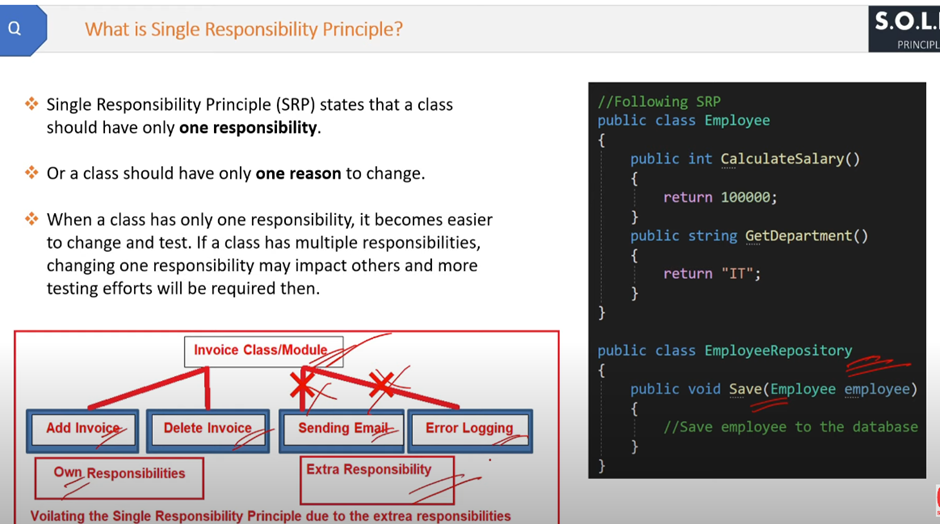
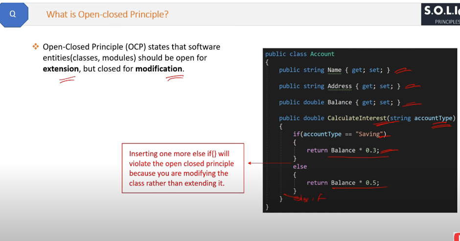
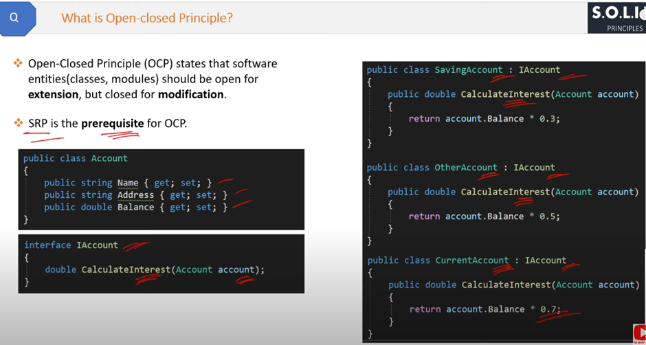
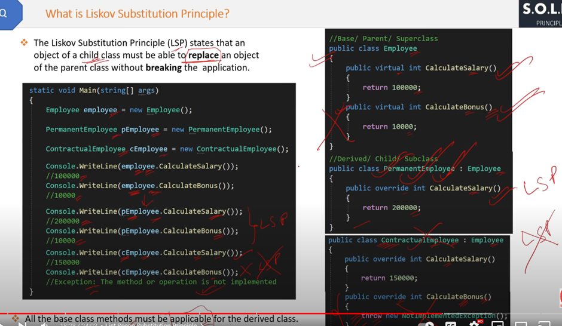
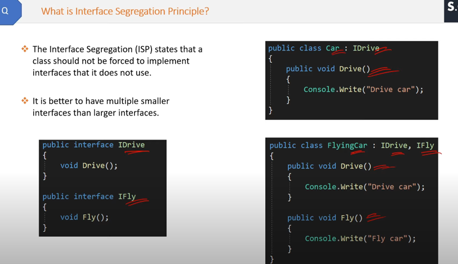

## ***1.SOLID Design Principles***

The SOLID principles are a set of five design principles intended to make software designs more understandable, flexible, and maintainable. These principles were introduced by Robert C. Martin and are widely used in object-oriented programming, including C#. Let's dive into each principle in detail:

### 1. **Single Responsibility Principle (SRP)**
**Definition**: A class should have only one reason to change, meaning it should have only one responsibility or job.

**Explanation**: This principle ensures that a class is focused on a single task or functionality. By doing so, the class becomes easier to understand, test, and maintain. If a class has multiple responsibilities, changes in one area might affect the other areas, leading to a fragile design.

**Example**:
```csharp
public class ReportGenerator
{
    public void GenerateReport()
    {
        // Code to generate report
    }
}

public class ReportPrinter
{
    public void PrintReport(ReportGenerator report)
    {
        // Code to print report
    }
}
```
In this example, `ReportGenerator` is responsible only for generating reports, and `ReportPrinter` is responsible only for printing reports.



### 2. **Open/Closed Principle (OCP)**
**Definition**: Software entities (classes, modules, functions, etc.) should be open for extension but closed for modification.

**Explanation**: This principle states that you should be able to extend the behavior of a class without modifying its existing code. This can be achieved through inheritance and polymorphism, allowing new functionality to be added by creating new subclasses.

**Example**:
```csharp
public abstract class Employee
{
    public abstract double CalculateBonus(double salary);
}

public class PermanentEmployee : Employee
{
    public override double CalculateBonus(double salary)
    {
        return salary * 0.1;
    }
}

public class ContractEmployee : Employee
{
    public override double CalculateBonus(double salary)
    {
        return salary * 0.05;
    }
}
```
In this example, the `Employee` class is open for extension by creating new subclasses (`PermanentEmployee`, `ContractEmployee`) without modifying the existing `Employee` class.

- The benefit is simple testing is required to test individual classes but if you will keep on adding and modifying in one class. Then even for the smallest modification, the whole class needs to be tested




### 3. **Liskov Substitution Principle (LSP)**
**Definition**: Subtypes must be substitutable for their base types without altering the correctness of the program.

**Explanation**: This principle ensures that a derived class can be used in place of its base class without causing errors or unexpected behavior. The derived class should enhance or extend the functionality of the base class without changing its essential behavior.

**Example**:
```csharp
public class Rectangle
{
    public virtual int Width { get; set; }
    public virtual int Height { get; set; }

    public int GetArea()
    {
        return Width * Height;
    }
}

public class Square : Rectangle
{
    public override int Width
    {
        set { base.Width = base.Height = value; }
    }

    public override int Height
    {
        set { base.Width = base.Height = value; }
    }
}
```
In this example, `Square` is a subtype of `Rectangle` and can be substituted for `Rectangle` without altering the correctness of the program.



### 4. **Interface Segregation Principle (ISP)**
**Definition**: Clients should not be forced to depend on interfaces they do not use.

**Explanation**: This principle advocates for creating small, specific interfaces rather than large, general-purpose ones. It ensures that a class only implements the methods it actually needs, promoting decoupling and making the system more modular.

**Example**:
```csharp
public interface IPrinter
{
    void Print();
}

public interface IScanner
{
    void Scan();
}

public class MultiFunctionPrinter : IPrinter, IScanner
{
    public void Print()
    {
        // Print implementation
    }

    public void Scan()
    {
        // Scan implementation
    }
}

public class SimplePrinter : IPrinter
{
    public void Print()
    {
        // Print implementation
    }
}
```

In this example, `IPrinter` and `IScanner` are separate interfaces, allowing `MultiFunctionPrinter` to implement both, while `SimplePrinter` only implements `IPrinter`.



### 5. **Dependency Inversion Principle (DIP)**
**Definition**: High-level modules should not depend on low-level modules. Both should depend on abstractions. Abstractions should not depend on details. Details should depend on abstractions.

**Explanation**: This principle encourages dependency on abstractions (e.g., interfaces or abstract classes) rather than concrete implementations. It helps achieve loose coupling between components and makes the system more flexible and easier to maintain.

**Example**:
```csharp
public interface IMessageSender
{
    void SendMessage(string message);
}

public class EmailSender : IMessageSender
{
    public void SendMessage(string message)
    {
        // Send email implementation
    }
}

public class SmsSender : IMessageSender
{
    public void SendMessage(string message)
    {
        // Send SMS implementation
    }
}

public class NotificationService
{
    private readonly IMessageSender _messageSender;

    public NotificationService(IMessageSender messageSender)
    {
        _messageSender = messageSender;
    }

    public void Notify(string message)
    {
        _messageSender.SendMessage(message);
    }
}
```
In this example, `NotificationService` depends on the abstraction `IMessageSender`, allowing it to use different implementations (`EmailSender`, `SmsSender`) without changing the `NotificationService` code.


### Summary
The SOLID principles are essential guidelines for designing robust, maintainable, and scalable software systems. 

## ***2.C# Architectural Patterns***
Architectural patterns in C# provide a blueprint for designing software applications, addressing common problems, and promoting best practices. Here’s a detailed explanation of some common architectural patterns used in C# applications:

### 1. Layered (N-Tier) Architecture

#### Overview:
- **Purpose:** Separates concerns into different layers, making the application easier to manage and maintain.
- **Layers:**
  - **Presentation Layer:** Handles the user interface and user interactions.
  - **Business Logic Layer (BLL):** Contains business rules and logic.
  - **Data Access Layer (DAL):** Manages data storage and retrieval.
  - **Database Layer:** The actual database where data is stored.

#### Benefits:
- Improved modularity and separation of concerns.
- Easier to maintain and test individual layers.
- Supports scalability and flexibility.

#### Example:
```csharp
// Presentation Layer
public class ProductController : Controller
{
    private readonly IProductService _productService;

    public ProductController(IProductService productService)
    {
        _productService = productService;
    }

    public IActionResult Index()
    {
        var products = _productService.GetAllProducts();
        return View(products);
    }
}

// Business Logic Layer
public interface IProductService
{
    IEnumerable<Product> GetAllProducts();
}

public class ProductService : IProductService
{
    private readonly IProductRepository _productRepository;

    public ProductService(IProductRepository productRepository)
    {
        _productRepository = productRepository;
    }

    public IEnumerable<Product> GetAllProducts()
    {
        return _productRepository.GetAll();
    }
}

// Data Access Layer
public interface IProductRepository
{
    IEnumerable<Product> GetAll();
}

public class ProductRepository : IProductRepository
{
    private readonly AppDbContext _context;

    public ProductRepository(AppDbContext context)
    {
        _context = context;
    }

    public IEnumerable<Product> GetAll()
    {
        return _context.Products.ToList();
    }
}
```

### 2. Microservices Architecture

#### Overview:
- **Purpose:** Breaks down an application into smaller, independent services that communicate over a network.
- **Characteristics:**
  - Each service is self-contained and implements a single business capability.
  - Services can be developed, deployed, and scaled independently.

#### Benefits:
- Improved scalability and flexibility.
- Easier to deploy and manage individual services.
- Supports continuous delivery and DevOps practices.

#### Example:
- An e-commerce application with separate microservices for user management, product catalog, order processing, and payment.

### 3. Model-View-Controller (MVC) Architecture

#### Overview:
- **Purpose:** Separates the application into three main components: Model, View, and Controller.
- **Components:**
  - **Model:** Represents the data and business logic.
  - **View:** Displays the data to the user.
  - **Controller:** Handles user input and updates the Model and View accordingly.

#### Benefits:
- Promotes separation of concerns.
- Easier to manage and test individual components.
- Supports multiple views for the same data model.

#### Example:
```csharp
// Model
public class Product
{
    public int Id { get; set; }
    public string Name { get; set; }
    public decimal Price { get; set; }
}

// Controller
public class ProductController : Controller
{
    private readonly IProductService _productService;

    public ProductController(IProductService productService)
    {
        _productService = productService;
    }

    public IActionResult Index()
    {
        var products = _productService.GetAllProducts();
        return View(products);
    }
}

// View (Index.cshtml)
@model IEnumerable<Product>

<h1>Product List</h1>
<ul>
    @foreach (var product in Model)
    {
        <li>@product.Name - @product.Price</li>
    }
</ul>
```

### 4. Event-Driven Architecture

#### Overview:
- **Purpose:** Uses events to trigger actions or workflows, promoting loose coupling between components.
- **Components:**
  - **Event Producers:** Generate events.
  - **Event Consumers:** Respond to events.
  - **Event Brokers:** Manage the distribution of events.

#### Benefits:
- Supports asynchronous communication and decoupling of components.
- Improved scalability and flexibility.
- Easier to integrate with external systems.

#### Example:
- An order processing system where events are generated for order creation, payment processing, and shipment, with corresponding consumers handling each event.

### 5. Domain-Driven Design (DDD)

#### Overview:
- **Purpose:** Focuses on the core domain and domain logic, using a common language and models to represent the business domain.
- **Components:**
  - **Entities:** Objects with a unique identity.
  - **Value Objects:** Objects with no identity, representing a concept in the domain.
  - **Aggregates:** Clusters of domain objects that can be treated as a single unit.
  - **Repositories:** Provide access to aggregates.
  - **Services:** Encapsulate domain logic that doesn't fit naturally within entities or value objects.

#### Benefits:
- Promotes a clear understanding of the business domain.
- Supports complex business logic and interactions.
- Encourages collaboration between developers and domain experts.

#### Example:
```csharp
// Entity
public class Order
{
    public int Id { get; set; }
    public Customer Customer { get; set; }
    public List<OrderItem> Items { get; set; }

    // Domain logic
    public void AddItem(Product product, int quantity)
    {
        // Add item to order
    }
}

// Value Object
public class Address
{
    public string Street { get; set; }
    public string City { get; set; }
    public string ZipCode { get; set; }
}

// Repository
public interface IOrderRepository
{
    Order GetById(int id);
    void Save(Order order);
}
```

### Summary

Architectural patterns in C# provide structured approaches to designing software applications, addressing common problems, and promoting best practices. By choosing the right architectural pattern based on your application's requirements, you can enhance scalability, maintainability, and efficiency.

## ***3.How dependecy***
## ***4.How dependecy***
## ***5.How dependecy***
## ***6.How dependecy***
## ***7.How dependecy***
## ***8.How dependecy***
## ***9.How dependecy***
## ***10.How dependecy***
## ***11.How dependecy***
## ***12.How dependecy***
## ***13.How dependecy***
## ***14.How dependecy***
## ***15.How dependecy***
## ***16.How dependecy***
## ***17.How dependecy***