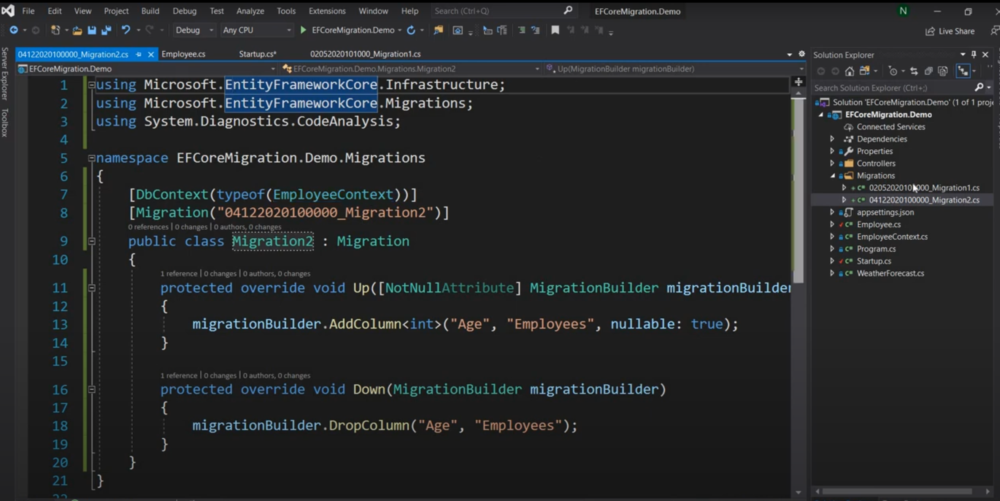
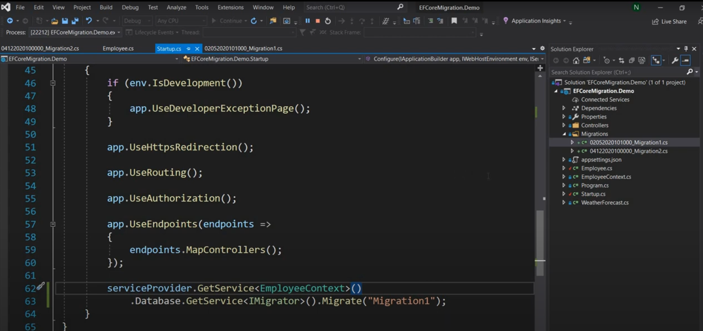

## ***1. How lazy loading works in entity framework***

In Entity Framework, lazy loading is a feature that delays the loading of related data until it is explicitly requested. This can help improve performance by loading only the data that is actually needed. Lazy loading is particularly useful when working with large datasets or when accessing related entities that might not always be required.

### **How Lazy Loading Works:**

When lazy loading is enabled, Entity Framework creates proxy classes that override virtual navigation properties. When a navigation property is accessed for the first time, a query is automatically sent to the database to load the related data.

### **Setting Up Lazy Loading:**

To use lazy loading in Entity Framework, you need to follow these steps:

1. **Ensure Navigation Properties are Virtual**:
   Navigation properties must be marked as `virtual` for Entity Framework to create proxy classes.

2. **Enable Lazy Loading**:
   Lazy loading is enabled by default in Entity Framework. If it has been disabled, you can enable it in the `DbContext` constructor.

### **Example:**

Consider a simple model with two entities: `Author` and `Book`. Each author can have multiple books.

**Step 1: Define the Entities with Virtual Navigation Properties**:

```csharp
public class Author
{
    public int AuthorId { get; set; }
    public string Name { get; set; }
    public virtual ICollection<Book> Books { get; set; } // Virtual navigation property
}

public class Book
{
    public int BookId { get; set; }
    public string Title { get; set; }
    public virtual Author Author { get; set; } // Virtual navigation property
}
```

**Step 2: Define the DbContext and Enable Lazy Loading**:

```csharp
public class LibraryContext : DbContext
{
    public DbSet<Author> Authors { get; set; }
    public DbSet<Book> Books { get; set; }

    public LibraryContext()
    {
        // Enable lazy loading if not already enabled
        this.Configuration.LazyLoadingEnabled = true;
    }
}
```

**Step 3: Use Lazy Loading in Code**:

```csharp
public class Program
{
    public static void Main()
    {
        using (var context = new LibraryContext())
        {
            // Add sample data
            var author = new Author { Name = "John Doe" };
            context.Authors.Add(author);
            context.Books.Add(new Book { Title = "C# Fundamentals", Author = author });
            context.Books.Add(new Book { Title = "Advanced C#", Author = author });
            context.SaveChanges();

            // Retrieve the author
            var retrievedAuthor = context.Authors.FirstOrDefault(a => a.Name == "John Doe");

            if (retrievedAuthor != null)
            {
                // Access the Books navigation property to trigger lazy loading
                foreach (var book in retrievedAuthor.Books)
                {
                    Console.WriteLine($"Book Title: {book.Title}");
                }
            }
        }
    }
}
```

**Explanation**:

1. **Define Entities**: The `Author` and `Book` classes have virtual navigation properties (`Books` and `Author`, respectively) to enable lazy loading.
2. **Define DbContext**: The `LibraryContext` class ensures that lazy loading is enabled.
3. **Use Lazy Loading**: When retrieving an `Author` and accessing the `Books` navigation property, Entity Framework automatically loads the related `Book` entities from the database.

### **Benefits and Considerations**

- **Benefits**: Improves performance by loading data only when needed, reduces initial data loading time, and simplifies code for handling related data.
- **Considerations**: Can lead to multiple database queries if not used carefully, potentially impacting performance. It's important to monitor and optimize the number of queries generated.

By understanding and utilizing lazy loading, you can efficiently manage related data in Entity Framework and improve the performance of your applications.

## ***2. What is AsNoTracking in Entity Framework***

`AsNoTracking` is a method in Entity Framework (EF) that allows you to execute a query without tracking the resulting entities in the change tracker. This can significantly improve performance for read-only queries where you do not need to update or delete the retrieved entities. Here’s a detailed explanation of `AsNoTracking`:

### Why Use AsNoTracking?

1. **Performance Improvement:**
   - When you query data using Entity Framework, it by default tracks the changes made to the entities retrieved. This involves additional processing and memory usage.
   - `AsNoTracking` disables change tracking for the entities, reducing the overhead and resulting in faster query execution and lower memory consumption.

2. **Read-Only Scenarios:**
   - `AsNoTracking` is ideal for scenarios where the data retrieved is intended for display or read-only purposes, and there is no intention to modify or save changes to these entities.
   - Examples include generating reports, displaying data on dashboards, or exporting data.

### How AsNoTracking Works

When you use `AsNoTracking` in a query, Entity Framework bypasses the tracking of the entities in the context. This means that the context does not keep track of changes to these entities, and they are not added to the `DbSet`’s change tracker.

### Syntax

You can use `AsNoTracking` by appending it to your LINQ query as follows:

```csharp
using (var context = new YourDbContext())
{
    var products = context.Products
        .AsNoTracking()
        .Where(p => p.Category == "Electronics")
        .ToList();
}
```

### Example Scenario

Let’s consider a simple example to illustrate how `AsNoTracking` can be used:

#### Scenario:

You have an e-commerce application, and you want to display a list of products in a specific category without modifying them.

#### Without AsNoTracking:

```csharp
using (var context = new ECommerceDbContext())
{
    var products = context.Products
        .Where(p => p.Category == "Electronics")
        .ToList();
    
    // Display products (read-only)
    foreach (var product in products)
    {
        Console.WriteLine(product.Name);
    }
}
```

In this example, Entity Framework tracks the changes to the `products` entities, even though you are only displaying the data.

#### With AsNoTracking:

```csharp
using (var context = new ECommerceDbContext())
{
    var products = context.Products
        .AsNoTracking()
        .Where(p => p.Category == "Electronics")
        .ToList();
    
    // Display products (read-only)
    foreach (var product in products)
    {
        Console.WriteLine(product.Name);
    }
}
```

In this example, `AsNoTracking` is used, and Entity Framework does not track the changes to the `products` entities, resulting in better performance for read-only queries.

### Summary

- **What is AsNoTracking?** `AsNoTracking` is a method in Entity Framework that allows you to execute queries without tracking the resulting entities, improving performance for read-only scenarios.
- **Why Use It?** It reduces the overhead of change tracking, resulting in faster query execution and lower memory consumption.
- **When to Use It?** Use `AsNoTracking` in scenarios where the data retrieved is for display or read-only purposes, and there is no intention to modify or save changes to these entities.
- **How to Use It?** Append `AsNoTracking` to your LINQ queries to disable change tracking for the entities.

By using `AsNoTracking` in appropriate scenarios, you can optimize the performance of your Entity Framework queries and improve the overall efficiency of your application.

## ***3. DbContext versus DbSet***

In Entity Framework, `DbContext` and `DbSet` are fundamental concepts that help you interact with the database in an object-oriented manner. They serve different purposes and have different roles in managing database operations. Here’s a detailed comparison to help you understand the differences and how they work together:

### **DbContext**

- **Definition**: `DbContext` is a class that manages the database connection and is used to query and save data. It serves as a bridge between the domain model and the database.
- **Responsibilities**:
  - Managing database connections.
  - Configuring the model and relationships.
  - Tracking changes to entities.
  - Coordinating database transactions.
  - Providing access to `DbSet` properties.
- **Usage**: You typically create a class that inherits from `DbContext` and define `DbSet` properties for each entity type in your model.

**Example**:

```csharp
public class LibraryContext : DbContext
{
    public DbSet<Author> Authors { get; set; }
    public DbSet<Book> Books { get; set; }

    protected override void OnConfiguring(DbContextOptionsBuilder optionsBuilder)
    {
        optionsBuilder.UseSqlServer("your_connection_string_here");
    }
}
```

In this example, `LibraryContext` inherits from `DbContext` and provides `DbSet` properties for the `Author` and `Book` entities.

### **DbSet**

- **Definition**: `DbSet` represents a collection of entities of a specific type that you can query and save. It acts as a proxy for the database table associated with the entity type.
- **Responsibilities**:
  - Allowing LINQ queries to be written against the set of entities.
  - Providing methods for adding, removing, and updating entities.
  - Tracking changes to entities within the context.
- **Usage**: You define `DbSet` properties in your `DbContext`-derived class and use them to interact with the entity sets.

**Example**:

```csharp
public class Author
{
    public int AuthorId { get; set; }
    public string Name { get; set; }
    public virtual ICollection<Book> Books { get; set; }
}

public class Book
{
    public int BookId { get; set; }
    public string Title { get; set; }
    public virtual Author Author { get; set; }
}

public class LibraryContext : DbContext
{
    public DbSet<Author> Authors { get; set; }
    public DbSet<Book> Books { get; set; }
}
```

In this example, `DbSet<Author>` represents a collection of `Author` entities, and `DbSet<Book>` represents a collection of `Book` entities.

### **Key Differences**

| Feature            | DbContext                               | DbSet                                        |
|--------------------|-----------------------------------------|----------------------------------------------|
| **Definition**     | Manages the database connection and operations | Represents a collection of entities of a specific type |
| **Responsibilities** | Configuring model, tracking changes, managing transactions | Querying, adding, removing, and updating entities |
| **Usage**          | Inherit from DbContext and define DbSet properties | Define as properties in the DbContext class  |
| **Scope**          | Acts as the overall context for the database | Acts as the proxy for individual tables/entities |

### **How They Work Together**

- **DbContext**: Provides the overall context and manages the connection to the database.
- **DbSet**: Represents collections of entities that can be queried and modified within the context.

**Example of Usage**:

```csharp
using (var context = new LibraryContext())
{
    // Add a new author
    var author = new Author { Name = "John Doe" };
    context.Authors.Add(author);
    context.SaveChanges();

    // Query authors
    var authors = context.Authors.ToList();
    foreach (var a in authors)
    {
        Console.WriteLine(a.Name);
    }
}
```

In this example, `LibraryContext` is used to manage the database connection and operations, while `DbSet<Author>` is used to add and query authors.

Understanding the roles of `DbContext` and `DbSet` in Entity Framework helps you effectively manage database interactions and maintain a clean, organized codebase.

## ***4. Rollback of Migrations in Entity Framework Core***
Rolling back migrations in Entity Framework Core can be crucial for maintaining the integrity of your database during development. Here’s a detailed explanation of how to rollback migrations:

### 1. Understanding Migrations

Migrations in Entity Framework Core allow you to evolve your database schema over time. Each migration represents a set of changes made to the model, which Entity Framework Core can apply to the database.

### 2. Tools Required

- **Visual Studio** or any IDE.
- **Entity Framework Core** installed in your project.

### 3. Generating a Migration

First, let's generate a migration to understand the context. Assuming you have a model and DbContext, you would create a migration using the following command:

```bash
dotnet ef migrations add InitialCreate
```

This command creates a new migration file under the `Migrations` directory.

### 4. Applying Migrations

To apply the migration to the database, use the following command:

```bash
dotnet ef database update
```

### 5. Rolling Back Migrations

To rollback migrations, you can use the `dotnet ef database update` command followed by the target migration name. For example:

#### Rollback to a Specific Migration

Assume you have the following migrations:
1. `InitialCreate`
2. `AddNewColumn`

If you want to rollback to `InitialCreate`, use the following command:

```bash
dotnet ef database update InitialCreate
```

This command will rollback any migrations applied after `InitialCreate`.

#### Rollback All Migrations

To rollback all migrations, specify `0` (zero) as the target migration:

```bash
dotnet ef database update 0
```

This command will rollback all applied migrations and return the database to its initial state.

### 6. Example Scenario

Here’s an example with a simple `Product` model and two migrations:

1. **Create the Product model**:

```csharp
public class Product
{
    public int Id { get; set; }
    public string Name { get; set; }
    public decimal Price { get; set; }
}
```

2. **Initial migration**:

```bash
dotnet ef migrations add InitialCreate
```

3. **Apply the migration**:

```bash
dotnet ef database update
```

4. **Add a new column to the Product model**:

```csharp
public class Product
{
    public int Id { get; set; }
    public string Name { get; set; }
    public decimal Price { get; set; }
    public string Description { get; set; } // New column
}
```

5. **Create the second migration**:

```bash
dotnet ef migrations add AddDescriptionColumn
```

6. **Apply the second migration**:

```bash
dotnet ef database update
```

7. **Rollback to the initial migration**:

```bash
dotnet ef database update InitialCreate
```

### 7. Reverting Changes in Code

Rolling back migrations will update the database schema, but remember to revert any changes made to the model classes or DbContext in your codebase.





### Summary

Rolling back migrations in Entity Framework Core involves using the `dotnet ef database update` command with the target migration name. This allows you to revert the database schema to a previous state, which is useful for undoing changes during development or testing.

